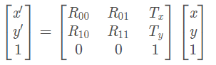

# CV_Learning
计算机视觉的一些学习记录

## (一) OpenCV
### 1. ndarray
   * 二维基本信息： 行、列、数据类型
   * 成员变量： shape、dtype
   * 访问 ndarray 中的值：例如第二行的所有值 `a[2, :]`，连续矩形区域的值 `a[0:2, 1:3]`
   
### 2. 图片通道
   * OpenCV读取的图像通道顺序为 **BGR**
   * PIL读取的图像通道顺序为 **RGB**
   * 灰度化：`gray = 0.114 * B + 0.587 * G + 0.229 * R`
   
### 3. 几何变换
#### 3.1 仿射变换

   * 平移
   * 缩放 （原点、任意一点为中心进行缩放）
   * 旋转

#### 3.2 投影变换
如果物体在三维空间中发生了旋转，那么这种变换通常称为投影变换。

#### 3.3 极坐标变换